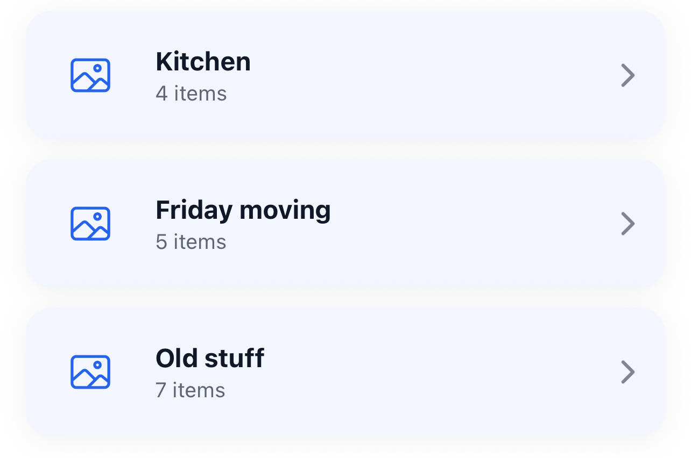
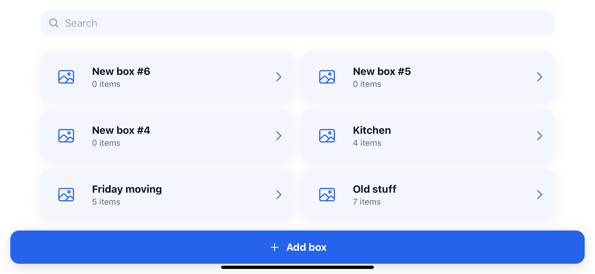
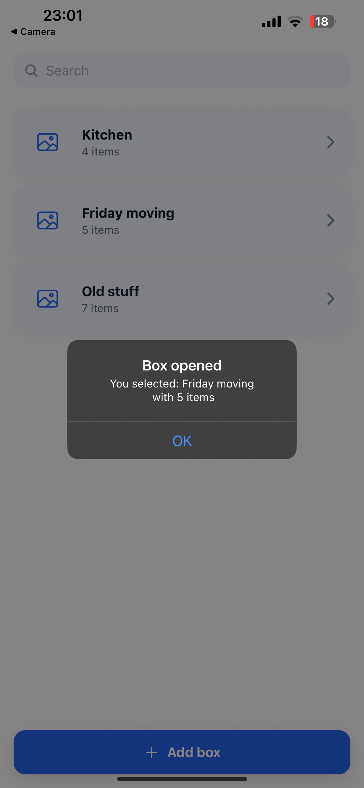
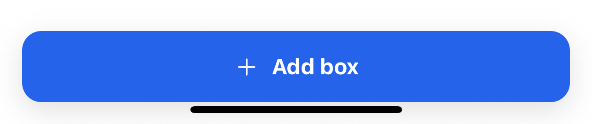

# 📦 Компоненти застосунку

## 🔍 Пошук

Компонент для пошуку серед наявних коробок. Користувач вводить текст, і список автоматично фільтрується за введеним запитом.

---

## 📂 Список коробок

Відображає всі створені коробки з назвою та кількістю елементів у кожній.  Абаптується під горизонтальний режим
При натисканні на коробку буде відкриватися її вміст.

---

## 📌 Повідомлення при відкритті коробки

Діалогове вікно з підтвердженням дії. Наприклад: *«Ви обрали: Friday moving з 5 елементами»*.

---

## ➕ Додавання нової коробки

Кнопка для створення нової коробки. При натисканні автоматично додається коробка.
